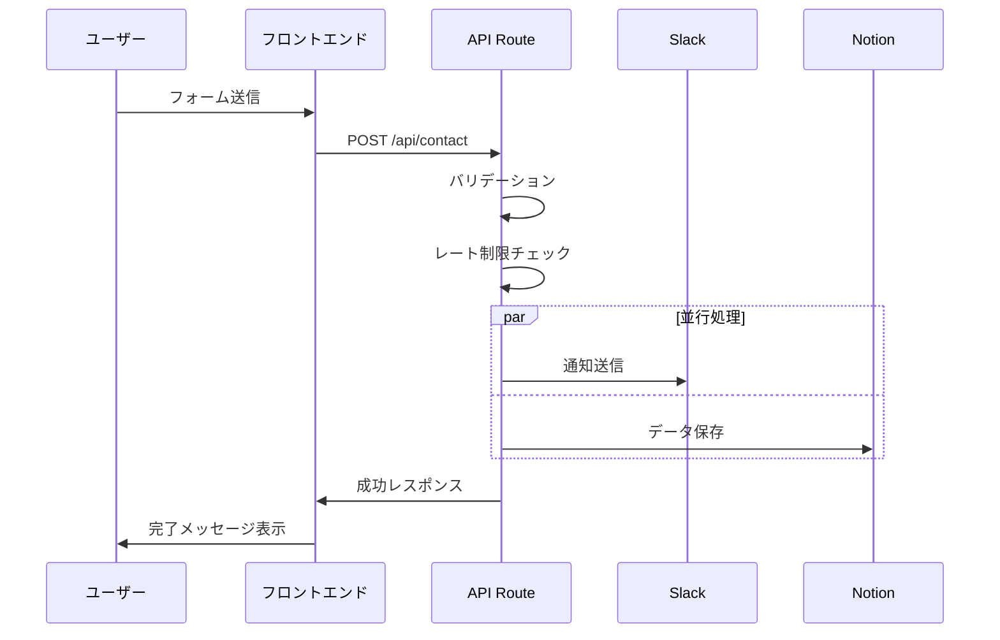

# お問い合わせ機能設計ドキュメント

## 1. 概要

### 1.1 機能概要

MakeTech のお問い合わせ機能は、技術記事に特化したフィードバック収集を目的として設計されたシステムです。ユーザーから寄せられる質問・感想・訂正依頼などを効率的に管理し、迅速な対応を可能にします。

### 1.2 主要特徴

- **技術記事特化**: 記事ページからの直接フィードバック収集
- **カテゴリ分類**: 問い合わせ内容に応じた自動分類
- **即時通知**: Slack 連携による迅速な対応
- **長期管理**: Notion Database による永続的な記録・管理
- **シームレス UX**: URL パラメータによる自動フォーム設定

## 2. ユーザー体験

### 2.1 記事フィードバックの流れ

```
1. ユーザーが技術記事を読む
2. 記事下部のフィードバックセクションを発見
3. 「質問・感想を送る」または「訂正・改善を提案」ボタンをクリック
4. お問い合わせページに遷移（記事情報が自動設定済み）
5. メッセージを入力して送信
6. 送信完了の確認メッセージを受信
```

### 2.2 一般問い合わせの流れ

```
1. ユーザーがお問い合わせページに直接アクセス
2. 問い合わせ種別を選択（一般、技術質問、お仕事依頼など）
3. 必要事項を入力して送信
4. 送信完了の確認メッセージを受信
```

## 3. 機能仕様

### 3.1 問い合わせカテゴリ

| カテゴリ               | 説明                 | 優先度 | 用途                   |
| ---------------------- | -------------------- | ------ | ---------------------- |
| 一般的なお問い合わせ   | その他の問い合わせ   | 低     | 基本的な質問・要望     |
| 記事へのフィードバック | 記事の感想・追加質問 | 中     | 記事改善・関連情報提供 |
| 記事の訂正依頼         | 記事の間違い・改善点 | 高     | 記事品質向上           |
| お仕事のご依頼         | 開発・制作依頼       | 高     | ビジネス機会           |
| 技術的なご質問         | 技術に関する質問     | 中     | 技術サポート           |

### 3.2 フォーム項目

#### 必須項目

- **名前**: 送信者の名前
- **メールアドレス**: 返信用アドレス
- **カテゴリ**: 問い合わせ種別
- **メッセージ**: 問い合わせ内容（最大 2000 文字）

#### 条件付き項目（記事関連カテゴリの場合）

- **関連記事タイトル**: 対象記事のタイトル
- **関連記事 URL**: 対象記事の URL

### 3.3 バリデーション仕様

| 項目           | バリデーション内容                 |
| -------------- | ---------------------------------- |
| 名前           | 必須、文字列、空白不可             |
| メールアドレス | 必須、有効なメール形式             |
| メッセージ     | 必須、2000 文字以内、HTML タグ除去 |
| カテゴリ       | 必須、定義済みカテゴリのみ         |
| 関連記事 URL   | URL 形式（記事関連カテゴリの場合） |

## 4. 技術設計

### 4.1 システム構成

```
フロントエンド層:
├── 記事ページ (posts/[slug]/page.tsx)
│   └── ArticleFeedback コンポーネント
├── お問い合わせページ (contact/page.tsx)
│   ├── ContactPageClient (URLパラメータ処理)
│   └── ContactForm (フォーム実装)

バックエンド層:
├── API Route (api/contact/route.ts)
│   ├── バリデーション
│   ├── レート制限
│   └── 並行処理
│       ├── Slack通知 (lib/slack.ts)
│       └── Notion保存 (lib/notion-contact.ts)

外部連携:
├── Slack (即時通知)
└── Notion Database (永続保存)
```

### 4.2 データフロー



## 5. セキュリティ設計

### 5.1 入力値検証

- **HTML サニタイズ**: 全テキスト入力から HTML タグを除去
- **文字数制限**: メッセージは 2000 文字以内
- **メール形式検証**: 正規表現による形式チェック
- **カテゴリ検証**: 定義済みカテゴリ以外を拒否

### 5.2 レート制限

- **IP 単位**: 1 分間に 3 回まで
- **制限時の動作**: 429 エラーレスポンス
- **実装方式**: メモリベースストア（本格運用時は Redis 推奨）

### 5.3 セキュリティヘッダー

- **CORS**: 適切なオリジン制限
- **Content-Type**: application/json 強制
- **XSS 対策**: 入力値のエスケープ処理

## 6. 外部連携仕様

### 6.1 Slack 連携

#### 設定要件

- Slack App 作成（Incoming Webhooks 機能）
- Webhook URL 設定
- 通知チャンネル指定

#### 通知内容

- 送信者情報（名前・メール）
- カテゴリ情報
- メッセージ内容（300 文字で切り詰め）
- 関連記事情報（該当する場合）
- 送信日時

#### 通知フォーマット

```json
{
  "channel": "#お問い合わせ",
  "username": "Contact Form",
  "text": "新しいお問い合わせが届きました",
  "attachments": [
    {
      "color": "カテゴリ別の色分け",
      "fields": [
        { "title": "名前", "value": "送信者名", "short": true },
        { "title": "カテゴリ", "value": "カテゴリ名", "short": true },
        { "title": "メール", "value": "メールアドレス", "short": false },
        { "title": "メッセージ", "value": "メッセージ内容", "short": false }
      ]
    }
  ]
}
```

### 6.2 Notion 連携

#### Database 構造

| プロパティ名     | 型     | 説明                             |
| ---------------- | ------ | -------------------------------- |
| 名前             | Title  | 送信者名（主キー）               |
| メールアドレス   | Email  | 返信用メールアドレス             |
| カテゴリ         | Select | 問い合わせ種別                   |
| メッセージ       | Text   | 問い合わせ内容                   |
| 関連記事 URL     | URL    | 対象記事の URL                   |
| 関連記事タイトル | Text   | 対象記事のタイトル               |
| 送信日時         | Date   | 問い合わせ受信日時               |
| ステータス       | Select | 未対応/対応中/完了               |
| 優先度           | Select | 高/中/低（カテゴリから自動設定） |

#### 自動設定ルール

```javascript
// 優先度の自動設定
switch (category) {
  case "correction":
    return "高"; // 記事の訂正依頼
  case "business":
    return "高"; // お仕事の依頼
  case "technical":
    return "中"; // 技術的な質問
  case "feedback":
    return "中"; // 記事へのフィードバック
  case "general":
    return "低"; // 一般的なお問い合わせ
}
```

## 7. エラーハンドリング

### 7.1 エラー分類

| エラー種別           | HTTP ステータス | 対応方法                             |
| -------------------- | --------------- | ------------------------------------ |
| バリデーションエラー | 400             | フロントエンドでエラーメッセージ表示 |
| レート制限エラー     | 429             | 一定時間後の再試行を促す             |
| 外部サービスエラー   | 500             | 部分的失敗でも処理継続               |
| 内部サーバーエラー   | 500             | 汎用エラーメッセージ表示             |

### 7.2 障害時の対応

#### Slack 通知失敗時

- ログ出力のみ
- 処理は継続（Notion 保存は実行）
- ユーザーには成功として通知

#### Notion 保存失敗時

- Slack に障害通知を送信
- 処理は継続（ユーザーには成功として通知）
- エラーログ出力

#### 両方失敗時（Phase 4 で実装予定）

- メール送信にフォールバック
- 管理者に緊急通知

## 8. 運用・管理

### 8.1 問い合わせ対応フロー

```
1. Slackで新着通知を受信
2. Notionで詳細内容・過去履歴を確認
3. ステータスを「対応中」に更新
4. メールで返信対応
5. 対応完了後、ステータスを「完了」に更新
```

### 8.2 定期メンテナンス

#### 週次作業

- 未対応問い合わせの確認
- 対応漏れのチェック
- 問い合わせ傾向の分析

#### 月次作業

- 問い合わせ件数・カテゴリ別統計
- 記事改善のフィードバック反映
- システムパフォーマンス確認

### 8.3 監視項目

- 問い合わせ受信数
- API 応答時間
- Slack/Notion 連携の成功率
- エラー発生率

## 9. URL パラメータ仕様

### 9.1 対応パラメータ

| パラメータ名 | 説明                   | 例                                    |
| ------------ | ---------------------- | ------------------------------------- |
| category     | カテゴリの自動選択     | feedback, correction                  |
| articleTitle | 記事タイトルの自動設定 | ReactHooks を使ったのでメモとして残す |
| articleUrl   | 記事 URL の自動設定    | https://example.com/posts/react-hooks |

### 9.2 使用例

```
記事フィードバック用:
/contact?category=feedback&articleTitle=ReactHooksを使ったのでメモとして残す&articleUrl=https://example.com/posts/react-hooks

記事訂正用:
/contact?category=correction&articleTitle=ReactHooksを使ったのでメモとして残す&articleUrl=https://example.com/posts/react-hooks
```

## 10. パフォーマンス仕様

### 10.1 レスポンス時間目標

- **API 応答時間**: 2 秒以内
- **フォーム送信完了**: 3 秒以内
- **ページ遷移**: 1 秒以内

### 10.2 最適化手法

- **並行処理**: Slack 通知と Notion 保存の同時実行
- **フォールバック**: 外部サービス障害時の継続処理
- **キャッシュ**: 静的リソースのキャッシュ活用

## 11. 今後の改善・拡張予定

### 11.1 Phase 4: システム安定性・可観測性向上

#### エラーハンドリング強化

- [ ] **API Route 改善**

  - より詳細なエラー分類とログ出力
  - 外部サービス障害時の自動リトライ機能
  - Slack/Notion 障害時のメール送信フォールバック
  - エラー発生時の Slack 管理者通知

- [ ] **フロントエンド改善**
  - ネットワークエラー時の再送信機能
  - より分かりやすいエラーメッセージ
  - フォーム送信中の重複送信防止
  - オフライン時の通知機能

#### パフォーマンス最適化

- [ ] **API 最適化**

  - レスポンス時間の監視・ログ出力
  - 大量リクエスト時の処理最適化
  - キャッシュ機能の追加（Redis 検討）

- [ ] **フロントエンド最適化**
  - コンポーネントの遅延読み込み
  - バンドルサイズの最適化

#### 監視・ログ機能

- [ ] **監視ダッシュボード**

  - 問い合わせ受信数の監視
  - API 応答時間の監視
  - エラー発生率の追跡

- [ ] **ログ強化**
  - 構造化ログの実装
  - 問い合わせフローの追跡可能性向上

#### 運用自動化

- [ ] **自動化機能**

  - 定期的なヘルスチェック
  - 週次/月次レポートの自動生成
  - 未対応問い合わせのリマインダー

- [ ] **セキュリティ強化**
  - より高度なレート制限
  - 不正アクセス検知
  - スパム対策の強化

#### システムクリーンアップ

- [ ] **旧システム削除**
  - nodemailer 関連コード削除
  - 不要な環境変数削除（EMAIL_USER, EMAIL_PASS）
  - 依存関係のクリーンアップ

### 11.2 将来的な機能拡張

#### 基本機能拡張

- [ ] 自動返信機能
- [ ] 問い合わせ追跡番号の発行
- [ ] ファイル添付機能
- [ ] チャットボット連携

#### 分析・改善機能

- [ ] 問い合わせ傾向の可視化
- [ ] 記事改善指標の提供
- [ ] ユーザーフィードバックの分析
- [ ] A/B テスト機能（フォーム UI 改善）

#### 運用効率化

- [ ] 自動ステータス更新
- [ ] 対応時間の測定
- [ ] 満足度調査の実装

### 11.3 実装優先度

| 項目                   | 優先度 | 実装時期目安       | 備考                     |
| ---------------------- | ------ | ------------------ | ------------------------ |
| Phase 4 全般           | 中     | 運用状況を見て判断 | 現在のシステムで十分安定 |
| エラーハンドリング強化 | 中高   | 問題発生時に対応   | 障害時の対応力向上       |
| 監視・ログ機能         | 中     | 運用データ蓄積後   | 分析ベースでの改善       |
| 自動返信機能           | 低中   | ユーザー要望次第   | UX 向上                  |
| ファイル添付機能       | 低     | 具体的な要望発生時 | セキュリティ考慮が必要   |

**注記**: 現在のシステムは十分実用的であり、Phase 4 は運用状況や他機能の優先度を考慮して実装時期を決定することを推奨します。

---

## 12. 関連ドキュメント

- [お問い合わせフォーム改修実装ドキュメント](./contact-form-redesign.md)
- [Slack 連携設定ガイド](./slack-integration-guide.md) ※今後作成予定
- [Notion Database 設定ガイド](./notion-database-guide.md) ※今後作成予定

---

_このドキュメントは、MakeTech お問い合わせ機能の包括的な設計・仕様書です。機能追加や変更時は本ドキュメントの更新も併せて行ってください。_
